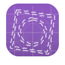

# libhelium Vala Template

Get started building an amazing app with libhelium & Vala today!

###

[](http://www.gnu.org/licenses/gpl-3.0)



> **Note**
> We know this README is barren, we're still working on it. If you have any questions or need help, feel free to join our [Discord](https://discord.gg/5fdPuxTg5Q)!


## 🛠️ Dependencies

Please make sure you have these dependencies first before building.

```bash
gtk4
libhelium-1
meson
vala
blueprint-compiler
```

## 🏗️ Building

Simply clone this repo, then:

```bash
meson _build --prefix=/usr && cd _build
sudo ninja install
```
